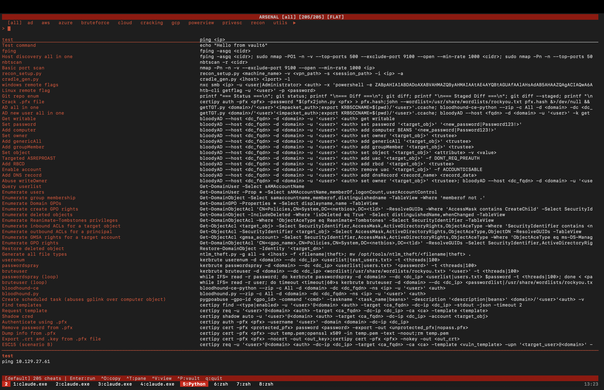

# Arsenal

Native terminal cheat launcher for pentesters. A fast, keyboard-driven TUI for managing and executing penetration testing commands.

Based on [aliasr](https://github.com/Mojo8898/aliasr) - rebuilt with Python's curses library for maximum compatibility (works on macOS, Linux, and anywhere with a terminal).



## Features

- **Batteries included** - Ships with 200+ built-in commands; never empty on a fresh install
- **Native curses TUI** - No heavy dependencies, works everywhere
- **Smart search** - Filters both categories and commands as you type
- **Category navigation** - Browse cheats by tags (cat/ad, cat/web, cat/privesc, etc.)
- **Tree view** - Toggle `Ctrl+V` to group commands by tool (nmap, nxc, etc.)
- **Vault switching** - Switch between cheat collections on-the-fly (`Ctrl+P`)
- **Parameter system** - Use `<param>` placeholders with global variables
- **Interactive params** - Override values on-the-fly without changing globals
- **tmux integration** - Send commands directly to tmux panes
- **Add cheats** - Create new commands from the TUI (`Ctrl+A`) or the CLI (`arsenal add`)
- **Aliasr compatible** - Reads standard aliasr markdown cheat format

## Installation

### From PyPI

```bash
pip install arsenal-tui
```

### From Source

```bash
git clone https://github.com/veil-protocol/arsenal.git
cd arsenal
pip install -e .
```

### Using uv

```bash
uv tool install arsenal-tui
```

## Usage

```bash
arsenal                                   # Launch TUI
arsenal scan <ip>                         # Quick-set target IP global
arsenal --help                            # Show help

# Manage cheats from the command line (scriptable — handy from a tmux pane)
arsenal add "<title>" "<command>"         # Add a cheat (defaults to the "custom" sheet)
arsenal add "Full TCP scan" "nmap -p- <ip>" --tags cat/recon cat/nmap --sheet nmap
arsenal new <sheet>                       # Create a new (empty) cheat sheet
arsenal sheets                            # List every loaded cheat file
```

`arsenal add` appends to `~/.cheats/<sheet>.md`, creating the sheet if it
doesn't exist. `--tags` takes space-separated tags (the `#` is optional) and
`--sheet` chooses the target file (default: `custom`). `<param>` placeholders
in the command are auto-added to your globals.

## Keybindings

| Key | Action |
|-----|--------|
| `←/→` | Switch category |
| `↑/↓` | Navigate commands |
| `Enter` | Run command (tmux execute or copy) |
| `Ctrl+O` | Copy to clipboard (always, even in tmux) |
| `Ctrl+T` | Pick target tmux pane |
| `Ctrl+V` | Toggle flat/tree view |
| `Ctrl+P` | Switch vault/playbook |
| `Ctrl+Y` | Yank raw command (no param editing) |
| `Ctrl+A` | Add new cheat command |
| `Ctrl+G` | Edit global variables |
| `Ctrl+D/U` | Page down/up |
| `Esc` | Clear search |
| `q` / `Ctrl+C` | Quit |

### In Parameter Editor

| Key | Action |
|-----|--------|
| `↑/↓` | Navigate parameters |
| `e` | Edit selected parameter |
| `Enter` | Execute with current values |
| `Esc` | Cancel |

## Cheat Format

Arsenal ships with a **built-in library of 200+ commands** (bundled inside the
package at `arsenal/data/cheats/`), so a fresh install is never empty. On top of
that it reads markdown files from, in order of precedence:
- `arsenal/data/cheats/` - bundled default library (shipped with the package)
- `~/.cheats/` - your writable overlay (where `arsenal add` and the TUI save)
- `/opt/my-resources/setup/arsenal-cheats/` - optional system-wide location

To make a custom cheat a permanent default, drop its `.md` into
`arsenal/data/cheats/` in a checkout and commit it.

### Markdown Format

````markdown
# Category Header
#cat/recon #cat/nmap

## Port Scan
```
nmap -sV -sC <ip> -oN scan.txt
```

## Full TCP Scan
#cat/recon
```
nmap -p- <ip> -oN full.txt
```
````

### Parameters

Use `<param>` syntax for variables:
- `<ip>` - Target IP
- `<username>` - Username
- `<password>` - Password
- `<domain>` - Domain name
- Any custom parameter

Parameters are auto-discovered and added to globals.

## Configuration

### Globals File

Global variables are stored in `~/.arsenal.json`:

```json
{
  "ip": "10.10.10.1",
  "username": "admin",
  "domain": "corp.local"
}
```

### Custom Cheats

Add your own cheats three ways:
- `arsenal add "<title>" "<command>" [--tags ..] [--sheet NAME]` from the shell
- `Ctrl+A` inside the TUI
- Hand-edit any `.md` under `~/.cheats/`

All three write to `~/.cheats/`, keeping the bundled default library untouched.

### Vaults / Playbooks

Switch between different cheat collections with `Ctrl+P`. Vaults are auto-discovered from:
- `~/.arsenal-playbooks/` - subdirectories become vaults
- `/opt/playbooks/` - subdirectories become vaults

Or define custom vaults in `~/.arsenal-vaults.json`:

```json
{
  "oscp": ["/path/to/oscp-cheats"],
  "htb": ["/path/to/htb-cheats", "/path/to/more-cheats"]
}
```

## tmux Integration

When running inside tmux, Arsenal automatically sends commands to the next pane and executes them. If not in tmux, commands are copied to clipboard instead.

Just press `Enter` - Arsenal detects tmux automatically.

## Color Scheme

Arsenal uses a red/black/white color scheme:
- Red: titles, labels, active elements
- White: commands, values
- White on Red: header and status bars

## Compatibility

- **macOS** - Full support (Terminal.app, iTerm2)
- **Linux** - Full support (any terminal)
- **Windows** - WSL recommended

Requires Python 3.10+

## License

MIT License - See [LICENSE](LICENSE) for details.

## Credits

**Primary reference**: [aliasr](https://github.com/Mojo8898/aliasr) by Mojo8898 - Arsenal is a native curses rewrite that works reliably on macOS and all platforms.

Built by [Veil Protocol](https://github.com/veil-protocol)
